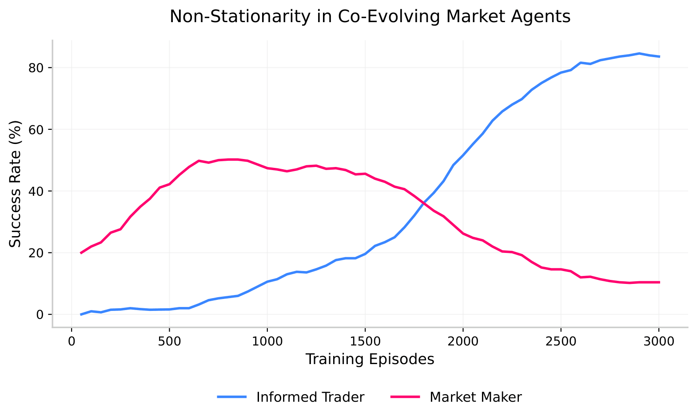

# Emergent Market Behavior through MARL

This repository implements two lightweight Tabular Q-Learning 
environments designed to isolate and observe emergent phenomena 
in Multi-Agent Reinforcement Learning (MARL) within simulated 
financial markets. Deep neural architectures are deliberately 
avoided to maintain mathematical clarity and focus purely on 
game-theoretic dynamics.

This is a Level 1 implementation. Future iterations will scale 
to deep MARL architectures (MADDPG, MAPPO) and continuous state 
spaces modeling realistic limit order book dynamics.

---

## Core Experiments

### 1. The Zero-Sum Baseline (1v1)

A pursuit-evasion game modeling imperfect information market 
conditions between an informed trader and a market maker.

The trader begins with a mixed strategy before converging to a dominant one; the market maker, lacking a fixed target, remains perpetually reactive. Thus never fully stable, never fully defeated.

Key findings: non-stationarity in co-evolving policies, 
asymmetric convergence, and emergent cost-of-carry minimization 
where the trader learns high-speed routing over stealth under 
vision-limited pursuit.



Full breakdown: [single/EXPLANATION.md](single/EXPLANATION.md)

---

### 2. The Mixed-Motive Bottleneck (2v1)

Two informed traders with asymmetric learning rates competing 
against a single market maker on a 5x5 grid.

The slow trader starts winning the moment it discovers the market maker will preferably chase the fast trader's dominant strategy, and the fast trader only starts winning once it learns to abandon that same strategy.

Key findings: emergent decoy effect without programmed 
coordination, spatial territory divergence, and implicit 
Nash equilibrium through board division.


Full breakdown: [multi/EXPLANATION.md](multi/EXPLANATION.md)

---

## Visualizations

Training scripts generate the following:

- Non-stationarity and rolling win rates
- Spatial occupancy heatmaps
- Action distribution evolution
- Episode duration convergence
- Self-play evaluation curves

---

## Quick Start

```bash
git clone https://github.com/aiyu221b3/self-play-in-marl-exp.git
cd self-play-in-marl-exp
pip install numpy matplotlib pandas
python single-form/baseline_1v1.py
python multi-form/multi_agent_2v1.py
```

---

## Citation

```
@misc{bhattacharya2026marl,
  title={Emergent Market Behavior through MARL},
  author={Ayushi Bhattacharya},
  year={2026},
  url={https://github.com/aiyu221b3/self-play-in-marl-exp}
}
```

---

## Acknowledgments

Core MARL environment, game-theoretic design, state 
representations, and reward structures developed independently 
with iterative feedback from **Claude (Anthropic)**.

Matplotlib visualization scripts refactored with assistance 
from **Google Gemini**.


---

