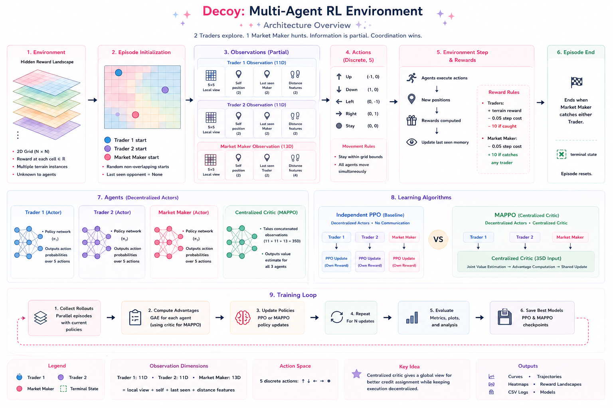
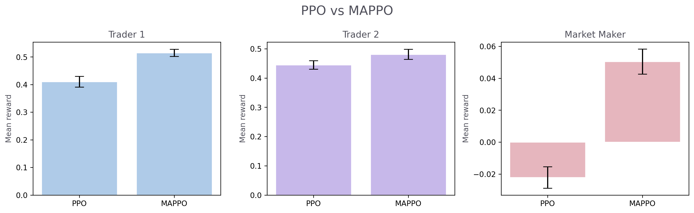
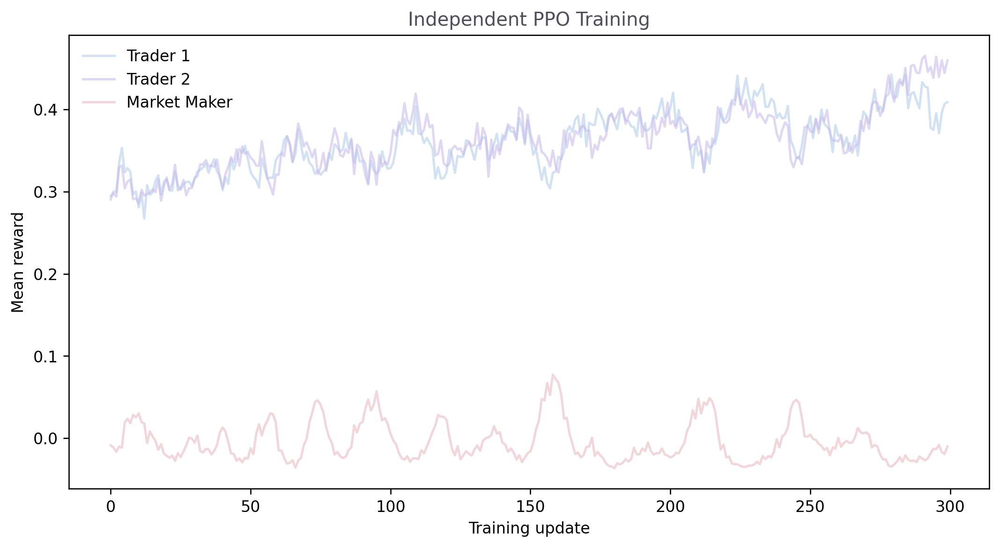
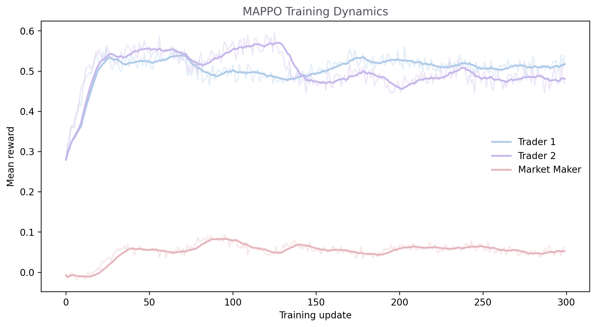
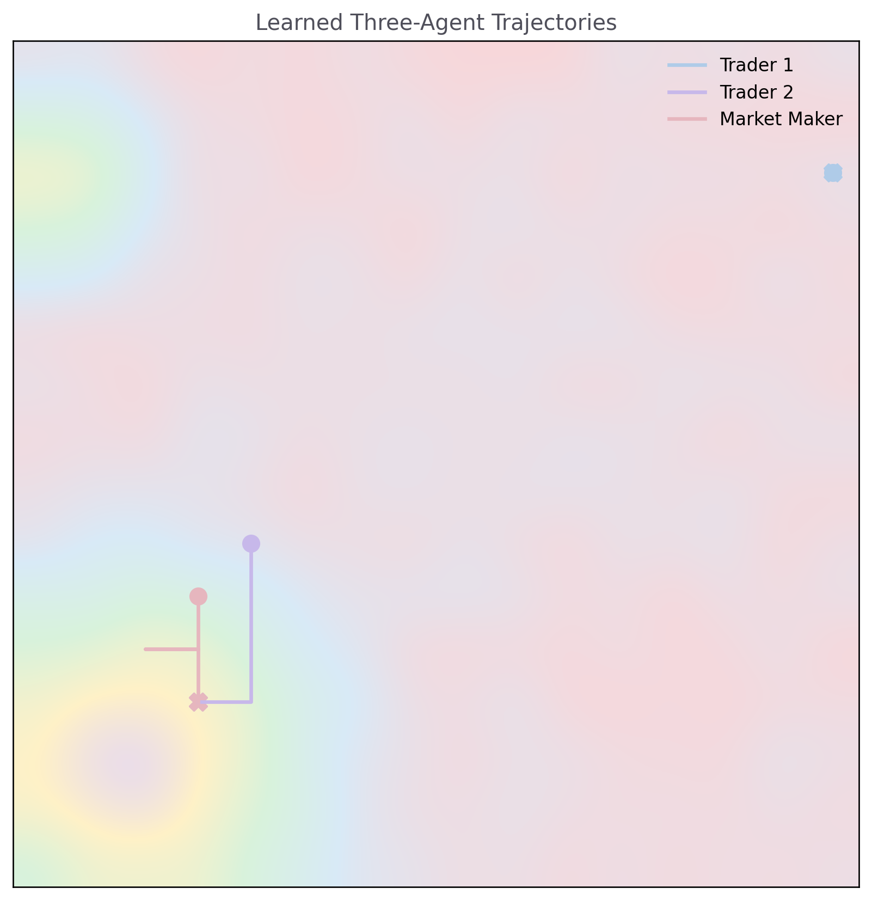

# Self-Play MARL

A lightweight 2v1 partially observable gridworld with two Traders and one Market Maker. Agents move on randomized reward landscapes, retain last-seen opponent information, and are trained with independent PPO or centralized-critic MAPPO.

## What we did

- Built a randomized 16×16 reward landscape with five discrete movement actions.
- Added partial observability through a 3×3 local terrain patch, normalized position, and last-seen opponent position.
- Trained two Traders and one Market Maker with independent PPO.
- Trained the same agents with MAPPO using a centralized 39D critic while keeping execution decentralized.
- Evaluated rewards, trajectories, visitation densities, action behavior, and robustness to reward distortion.
- Exported plots, logs, and model checkpoints as reproducible artifacts.

## Architecture

Each agent receives a 13D observation:

`2D position + 9D local terrain patch + 2D last-seen opponent position`

The three decentralized actors output probabilities over five actions. MAPPO additionally uses a centralized critic receiving the concatenated 39D observations.


Creds for image: ChatGPT.
## Results

| Comparison | PPO | MAPPO |
|---|---:|---:|
| Trader 1 | 0.410 | 0.515 |
| Trader 2 | 0.445 | 0.481 |
| Market Maker | -0.022 | 0.050 |

The clearest effect is agent-specific: MAPPO improves all three agents, with the Market Maker moving from slightly negative to positive mean reward.

 
 


 

## Structure

```text
decoy/
├── README.md
├── requirements.txt
├── LICENSE
├── .gitignore
│
├── src/
│   ├── __init__.py
│   ├── config.py
│   ├── environment.py
│   ├── agents.py
│   ├── training.py
│   ├── evaluation.py
│   └── visualization.py
│
├── assets/
│   ├── agent_trajectories.png
│   ├── mappo_training.png
│   ├── market_maker_density.png
│   ├── ppo_training.png
│   ├── ppo_vs_mappo.png
│   ├── reward_landscapes.png
│   ├── terrain_trajectory.png
│   ├──trader_1_density.png
│   └── trader_2_density.png
│
└── results/
    ├── rewards.csv
    ├── training.csv
    ├── distortion.csv
    ├── ppo.pt
    └── mappo.pt
```

- `environment.py` — landscapes, observations, movement, rewards, capture, and last-seen memory.
- `agents.py` — actor networks and centralized MAPPO critic.
- `training.py` — rollouts, GAE, PPO, and MAPPO updates.
- `evaluation.py` — evaluation trajectories and visitation statistics.
- `visualization.py` — plots and result artifacts.
- `run.py` — experiment entry point and checkpoint export.

## Run

```bash
pip install -r requirements.txt
python run.py
```

For a small smoke run:

```bash
python run.py --steps 10 --batch 64 --horizon 32
```

Outputs are written to `results/`.
