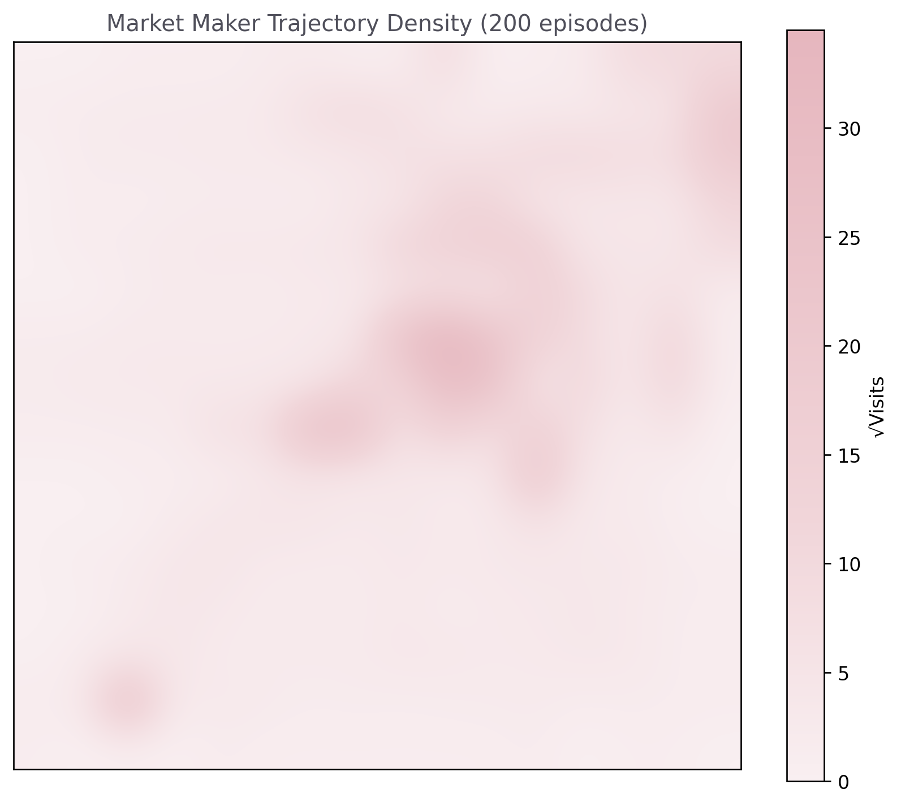
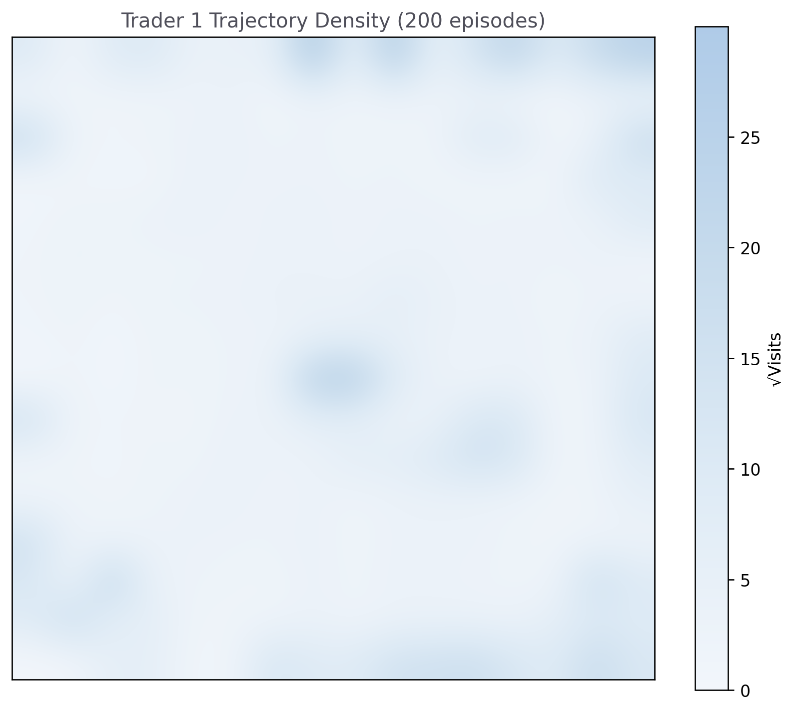
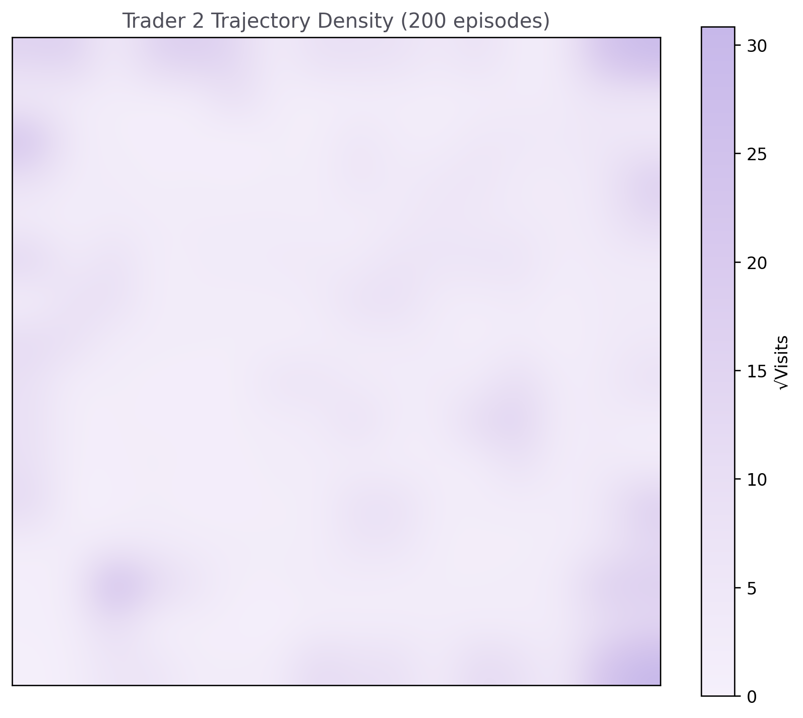

# Self-Play MARL

A lightweight 2v1 partially observable gridworld with two Traders and one Market Maker. Agents move on randomized reward landscapes, retain last-seen opponent information, and are trained with independent PPO or centralized-critic MAPPO.

## What we did

- Built a randomized 16×16 reward landscape with five discrete movement actions.
- Added partial observability through a 3×3 local terrain patch, normalized position, and last-seen opponent position.
- Trained two Traders and one Market Maker with independent PPO.
- Trained the same agents with MAPPO using a centralized 39D critic while keeping execution decentralized.
- Evaluated rewards, trajectories, visitation densities, action behavior, and robustness to reward distortion.
- Exported plots, logs, and model checkpoints as reproducible artifacts.

## Architecture

Each agent receives a 13D observation:

`2D position + 9D local terrain patch + 2D last-seen opponent position`

The three decentralized actors output probabilities over five actions. MAPPO additionally uses a centralized critic receiving the concatenated 39D observations.


Creds for image: ChatGPT.
## Results

| Comparison | PPO | MAPPO |
|---|---:|---:|
| Trader 1 | 0.410 | 0.515 |
| Trader 2 | 0.445 | 0.481 |
| Market Maker | -0.022 | 0.050 |

Trader 1 and Trader 2 share identical architecture and training but do not converge to symmetric outcomes under MAPPO near the training distribution, Trader 1 reaches +0.33 mean reward while Trader 2 sits at -0.35. This tracks the divergence visible in the MAPPO training curve (Trader 2 spikes then drops relative to Trader 1 mid-training). Whether this reflects real emergent specialization or seed/checkpoint variance hasn't been checked.
The clearest effect is agent-specific: MAPPO improves all three agents, with the Market Maker moving from slightly negative to positive mean reward.

 
 


 
Density graphs:
  

### Robustness to Landscape Distortion

Both algorithms were evaluated across landscape distortion levels (0 to 0.8) blending the training landscape with increasing noise to test how mean reward holds up away from the training distribution.

| Distortion | PPO Trader 1 | PPO Trader 2 | PPO MM | MAPPO Trader 1 | MAPPO Trader 2 | MAPPO MM |
|---:|---:|---:|---:|---:|---:|---:|
| 0.0 | 0.152 | 0.416 | 0.139 | 0.328 | -0.351 | 1.015 |
| 0.8 | 0.228 | 0.481 | 0.169 | 0.549 | 0.365 | 0.256 |

Full sweep in `results/ppo_distortion.csv` and `results/mappo_distortion.csv`.

MAPPO's Market Maker advantage is concentrated near the training distribution (reward ~1.0, capture ~24% at distortion 0) and degrades under landscape shift (reward ~0.26, capture ~15% at distortion 0.8), while both traders improve over the same range. Independent PPO stays comparatively flat for all three agents across the same sweep the centralized critic's benefit for the Market Maker doesn't generalize as well as it performs on-distribution.

## Structure

```text
self-play/
├── README.md
├── requirements.txt
├── LICENSE
├── .gitignore
├── architecture.png
│
├── src/
│   ├── __init__.py
│   ├── config.py
│   ├── environment.py
│   ├── agents.py
│   ├── training.py
│   ├── evaluation.py
│   └── visualization.py
│
├── assets/
│   ├── agent_trajectories.png
│   ├── mappo_training.png
│   ├── market_maker_density.png
│   ├── ppo_training.png
│   ├── ppo_vs_mappo.png
│   ├── reward_landscapes.png
│   ├── terrain_trajectory.png
│   ├──trader_1_density.png
│   └── trader_2_density.png
│
└── results/
    ├── ppo_mappo_final.csv
    ├── ppo_training_history.csv
    ├── mappo_training_history.csv
    ├── ppo_distortion.csv
    ├── mappo_distortion.csv
    ├── observation_spec.csv
    ├── ppo_history.npy
    ├── mappo_history.npy
    ├── mappo_losses.npy
    ├── trader1_density.npy
    ├── trader2_density.npy
    └── market_maker_density.npy
```

- `environment.py` — landscapes, observations, movement, rewards, capture, and last-seen memory.
- `agents.py` — actor networks and centralized MAPPO critic.
- `training.py` — rollouts, GAE, PPO, and MAPPO updates.
- `evaluation.py` — evaluation trajectories and visitation statistics.
- `visualization.py` — plots and result artifacts.
- `run.py` — experiment entry point and checkpoint export.

## Run

```bash
pip install -r requirements.txt
python run.py
```

For a small smoke run:

```bash
python run.py --steps 10 --batch 64 --horizon 32
```

Outputs are written to `results/`.
