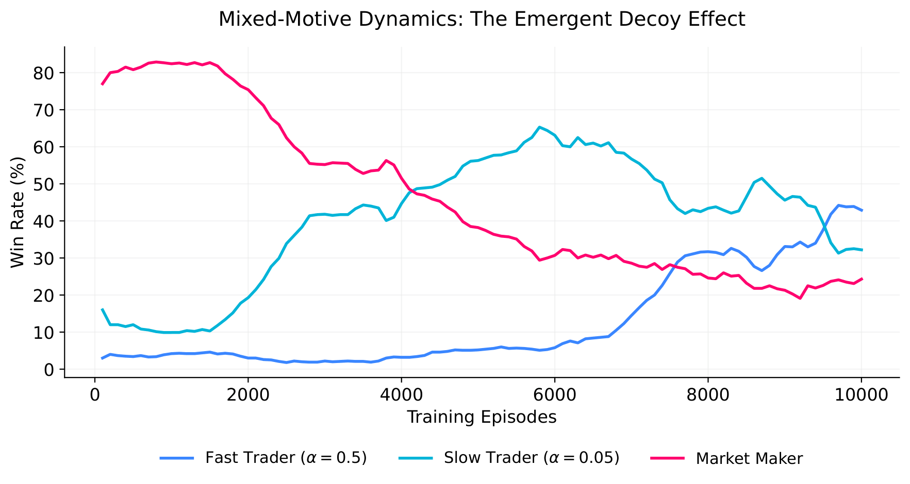
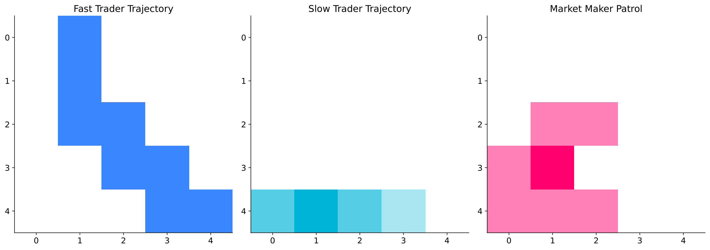

# 2v1: Mixed-Motive Market (The Decoy Effect)

## What This Models

The experiment illustrates a more complex market structure; necessarily the interaction between two competing **informed traders** and a single **market maker**. It is exhibited in a scenario where multiple institutions attempt to accumulate the same asset, operating under the same reward incentives but possessing different execution latencies or adaptation speeds. 

This maps directly to real market microstructure problems: what happens when multiple informed participants are active in the market simultaneously? How does a market maker prioritize its pursuit? Neither trader is told to cooperate or compete. The strategies emerge purely from the shared environment dynamics and the reward signal alone.

---

## The Environment

A $5 \times 5$ grid represents the price-time space. The accumulation target is at $(0, 0)$. *To be noted though, the grid has been minimized purely due to the curse of dimensionality.*

* **Fast Trader:** Starts at $(4, 4)$.
* **Slow Trader:** Starts at $(0, 4)$.
* **Market Maker:** Starts at $(2, 2)$, thus mid-market.

In this iteration, the partial observability and distance-based urgency penalties have been removed to strictly isolate the multi-agent coordination dynamics. 

**Terminal conditions:**
- **Detected:** If the market maker occupies the same cell as *either* trader, it intercepts them. Market maker wins $+10$, the caught trader receives $-10$.
- **Accumulated:** If *either* trader reaches $(0, 0)$, that trader wins $+10$, and the market maker receives $-10$.

In both scenarios, the other remains unaffected.

---

## The Agents

All three agents use **Tabular Q-Learning**, thus building knowledge from scratch through trial and error. However, to simulate different execution systems, they are initialized with different learning rates ($\alpha$):

* **Fast Trader ($\alpha = 0.5$):** Aggressively overwrites its Q-table, simulating a high-frequency firm that adapts to recent market states instantly.
* **Market Maker ($\alpha = 0.1$):** Modifies its strategy at a moderate, standard pace.
* **Slow Trader ($\alpha = 0.05$):** Sluggishly updates its values, simulating a larger, slower institution that requires significant historical data to pivot its strategy.

---

## What Emerged

Nobody programmed any of these behaviors. They arose from the asymmetric learning speeds and the shared reward signal alone.

**The Emergent Decoy Effect:** As observed in the win rate dynamics, the market maker completely dominates the initial phases of training. Because the Fast Trader ($\alpha = 0.5$) aggressively updates its policy, it quickly learns to rush the target. It becomes predictable prey, and the market maker learns to farm the Fast Trader for consistent positive rewards. 

Consequently, the market maker's attention is entirely occupied. This allows the Slow Trader, despite its sluggish learning and random wandering, to stumble into the target uncontested. Because the Fast Trader acts as an unintentional decoy, the Slow Trader's win rate spikes dramatically, peaking near 60% by episode 6000.

**Nash Equilibrium through Spatial Divergence:** Around episode 6000, the Fast Trader finally accumulates enough negative reward to unlearn its rushing behavior. The spatial heatmaps reveal how the two traders implicitly divide the board without any communication. The Slow Trader strictly occupies the bottom edge across the $y=4$ axis, while the Fast Trader carves a wide outer perimeter on the right.

This spatial divergence physically forces the market maker into decision paralysis. Since the maker is stuck in the middle and cannot patrol both distinct corridors simultaneously, its win rate crashes to roughly 20%, leaving both traders to stabilize at a mixed-motive equilibrium of ~40% win rates each.

---

## Limitations

**Independent Updates (IQL):** All three agents update their Q-tables simultaneously using only local information. In a 3-agent system, the non-stationarity is significantly amplified, which is evident in the volatile, sweeping curves of the win rate plot before equilibrium is finally reached at episode 9000. 

**Shared Target Bottleneck:** Because both traders must ultimately converge at $(0, 0)$, they occasionally block or interfere with each other's terminal moves. Future iterations could benefit from continuous state spaces and neural network function approximation (e.g., MAPPO) to handle multi-agent collision avoidance more gracefully.