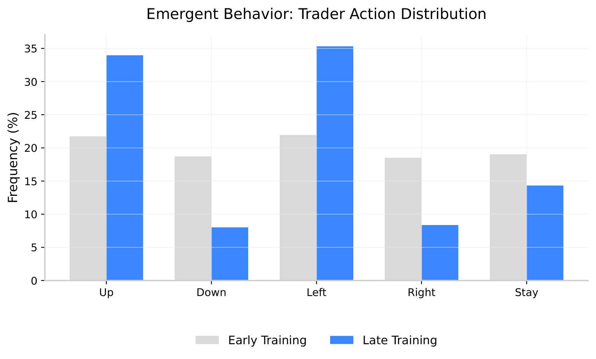
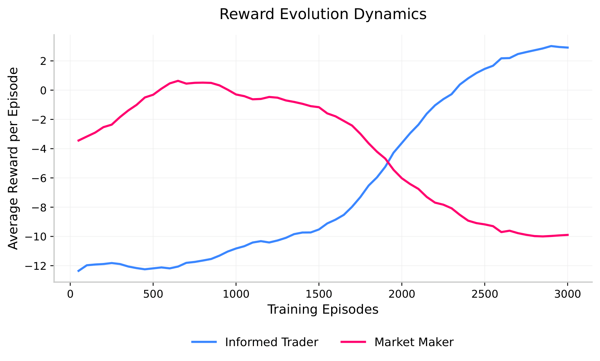
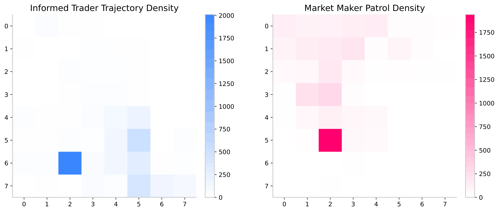
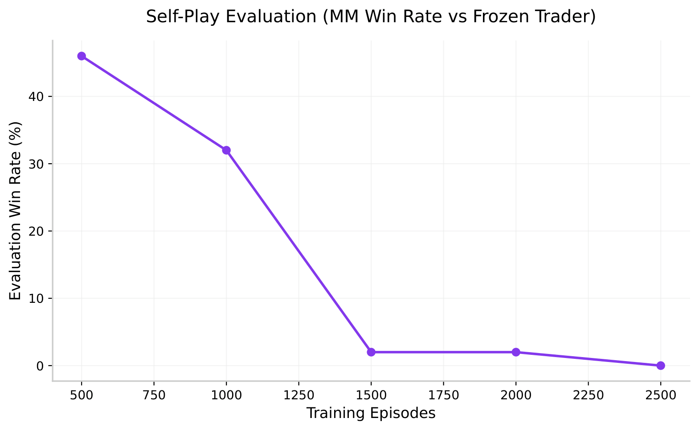
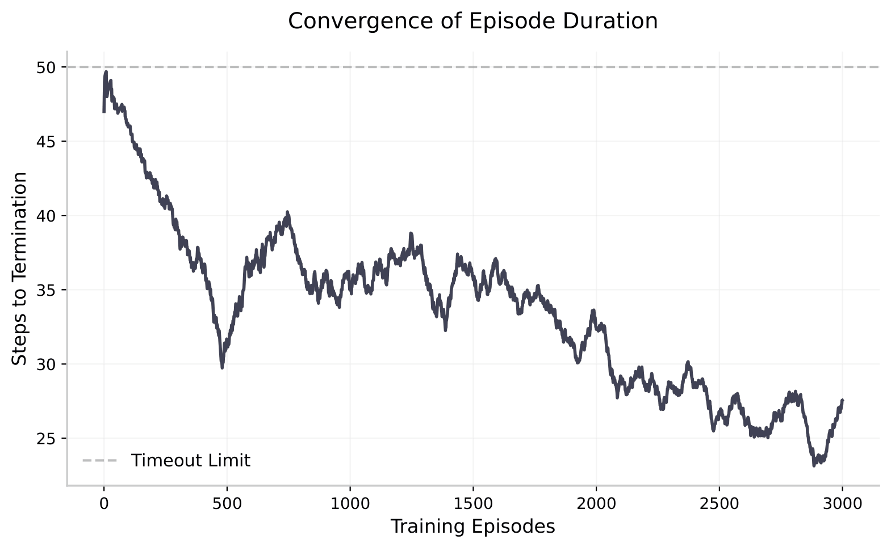

# Baseline 1v1: Zero-Sum Market Simulation

## What This Models

The experiment illustrates a key tension in financial markets; necessarily the interaction between an **informed trader** and a **market maker**. It is exhibited in a much simpler scenario than real-world experiments, emerging from a simple game of hide and seek operating under asymmetric information.

The informed trader is aware of the true value of an asset and attempts to accumulate a particular position without being detected by the market maker. The market maker proceeds in a search for the trader to intercept before the trading concludes, only observing partial order flow.

This maps directly to real market microstructure problems: how does each agent develop the behavior its role demands, purely from reward? How does the behaviour of the market maker being incentivised to detect order flow, and the trader disguising its accumulation intent emerge? Neither agent is 
told how to behave. The strategies emerge from the reward signal alone.

---

## The Environment

An $8$ x $8$ grid represents price-time space. The informed trader 
starts at $(7,7)$ which lies to be a high price zone far from the target. The 
market maker starts at $(2,2)$, thus mid-market. Each episode employs a maximum step count of 50.

**Terminal conditions, in order of priority:**

- **Detected:** both agents occupy the same cell. Market maker wins.
- **Accumulated:** trader reaches $(0,0)$. Informed trader wins.
- **Timeout:** 50 steps elapse. Neither agent wins.

**Why the rewards are designed this way:**

The $+10/-10$ structure for terminal events creates a strong 
incentive to win in the minimum number of steps possible. The 
small per-step penalty of $-0.1$ prevents agents from learning 
to stall indefinitely. The distance penalty on the trader which is $(x+y) × 0.01$ per step creates urgency. Sitting at $(7,7)$ 
costs more per step than sitting at $(1,1)$. This nudges the 
trader toward the target without hardcoding a path.

The market maker has no distance penalty because its task is 
interception, not navigation toward a fixed target.

---

## The Agents

Both agents use **Tabular Q-Learning**, which a model-free algorithm 
that learns purely from interaction. Neither agent has prior 
knowledge of the environment, the other agent's strategy, or 
the optimal path. They build knowledge from scratch through 
trial and error.

**State representation:**

The informed trader's state is its own position plus the market 
maker's current position which is the full information about the risk.

However, the market marker's state is determined by its own position plus the **last known** position of the trader. This is **partial observability.** It thus behaves as a real market participant does, i.e., with incomplete signals than the full order book. Another step happens every iteration, it calculates the Chebyshev distance between the present positions of the trader and market maker, and outputs the distance between them. The vision radius is considered as $3$, and only if the distance lies to be lesser than or equal to that; the market maker is then prompted with the present position of the trader.

**Why the agents have different learning difficulties:**

The trader's reward signal is clean and direct, that is to reach $(0,0)$, 
get $+10$. The maker's detection problem is harder. It must 
infer the trader's location from stale data and patrol 
intelligently across a large grid. This asymmetry in problem 
difficulty is why the trader proceeds to win the co-evolutionary arms 
race by episode 3000.

---

## What Emerged

Nobody programmed any of these behaviors. They arose from 
the reward signal alone.

**Cost-of-Carry Minimization & High-Speed Routing:** 
The action distribution perfectly captures the Trader's 
optimization of the "cost-of-carry" distance penalty. 
In early training, movement is uniformly distributed. 
By late training, the Trader heavily skews its distribution 
exclusively toward the target vectors while reducing misdirected
movement. 
Rather than attempting to "hide" or move stealthily 
(which bleeds reward due to the penalty), the Trader learns
that the optimal evasion strategy against a Maker with 
limited vision is pure kinematic speed; sprinting out of the
observation window and driving the episode duration down to 
its theoretical minimum.

**Non-stationarity:** The market maker's detection rate never 
stabilizes. It fluctuates throughout training because the 
trader's strategy keeps evolving. Every time the maker learns 
to counter one pattern, the trader has already moved on. 
This is the core challenge of MARL. Neither agent ever 
experiences a truly stationary environment because the other 
agent is simultaneously learning.

**Asymmetric convergence:** The reward evolution plot shows 
a clean crossover around episode 1900. Before this point 
the maker holds a small reward advantage. Early random 
exploration makes the trader easy to catch. After this 
point the trader's learned evasion strategy dominates 
and never relinquishes the lead. The maker stabilizes at 
a persistent negative reward, unable to recover.

**Territorial strategy:** The spatial heatmaps show that both agents developed implicit territories without being told to. Rather than a straight diagonal, the trader learned an edge-hugging route, creating a massive, high-density staging area at coordinate (2,6) before making its final sprint to the target. The maker learned to aggressively patrol the boundary of this territory, clustering heavily at (2,5) to intercept the trader's most frequent breakout point. Neither was given a map; these standoff territories emerged purely from thousands of Q-table updates.

**Developed policies lead to execution efficiency?** 
To validate that the learned policies are effective, the agents were evaluated in isolated self-play. Visibly, the overall duration of each episode steadily drops, proving the agents mathematically eliminate random wandering in favor of highly optimized kinematic pathing.

---

## Limitations

**Tabular Q-learning does not scale.** The state space here 
is $64 × 64 = 4,096$ possible states per agent. While manageable 
for an 8x8 grid, but this explodes exponentially with grid 
size, number of agents, or more complex observations. Real 
financial markets have continuous state spaces that make 
tabular methods completely infeasible. Scaling to realistic 
market conditions requires function approximation via neural 
networks which is the approach taken by MADDPG and MAPPO.

**Fixed starting positions** mean both agents learn strategies 
tuned to one specific initial configuration. A more robust 
experiment would randomize starting positions across episodes.

**No communication** between agents means any coordination 
is purely emergent from shared environment dynamics. Real 
market participants have access to public order book data 
which functions as an implicit communication channel.
This experiment deliberately excludes that to isolate 
pure learning dynamics.

**Independent updates.** Both agents update their Q-tables 
simultaneously using only local information. This is 
Independent Q-Learning (IQL), which has no convergence 
guarantees in multi-agent settings. The non-stationarity 
observed in the win rate curves is a direct consequence 
of this.

**Stochastic Convergence** Because Tabular IQL lacks 
mathematical convergence guarantees, different random 
seeds yield different local optima. While the Trader 
consistently achieves an $>80%$ win rate across runs, 
the specific evasion geometry (e.g., stealth/pausing 
vs. edge-sprinting) is highly sensitive to 
early-episode exploration noise.
